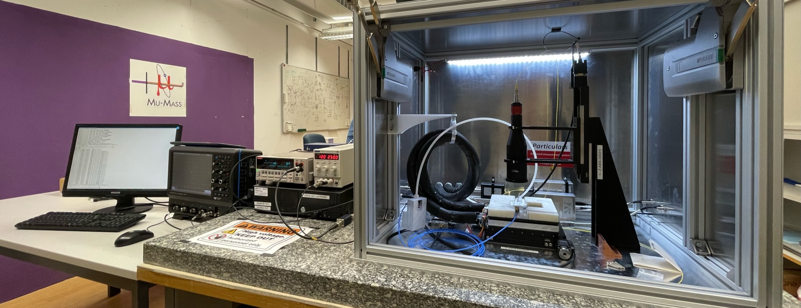
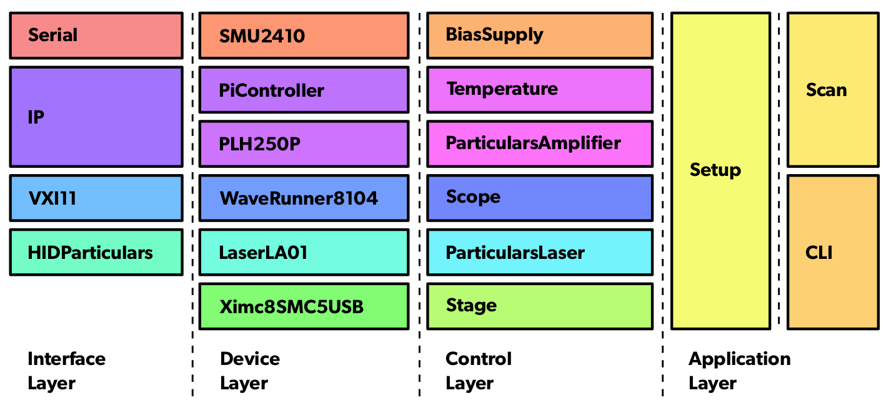

# Control for the Sensor TCT Setup at ETHZ (Rubbia-Group)

This software framework implements the full control and data acquisition of the TCT setup at ETHZ.
It was developed as part of the PhD thesis work of Johannes Wüthrich.
The corresponding PhD thesis will be linked here in the future.
The image below shows a view of the TCT setup including the data acquisition oscilloscope and the control computer, which runs this framework.

The framework is specifically implemented for the TCT setup at ETHZ, but can be easily adapted for other setups based on the [Particulars (Large) Scanning TCT systems](http://particulars.si/products.php).
It offers an open-source python based alternative to the closed-source LabView based control software offered by Particulars.
It is implemented with a high grade of automation in mind, allowing to automatically run scans based on text based config files.
It also allows to directly created analysis plots after the termination of each scan, enabling fast iteration and turn-around.

This software is in parts inspired by another open-source implementation of a [TCT control software framework by M. Senger](https://github.com/SengerM/PyticularsTCT).

## Framework Structure

### TCT Control
All classes involved in controlling the physical TCT setup are implemented under `tct`.
The following figure shows the general software stack:

The lowest level of the software stack is shown on the left.
All devices are controlled via either serial, USB or Ethernet connections.

### Analysis
The code related to the online analysis is located under `analysis`.
The main functionality is the loading and handling of previously acquired TCT data.
This module also implements simulation models related to the bonded diode samples implemented as part of this thesis.

## Usage
There are two main utilities implemented in this framework:

- **Command Line Interface**: To manually control the TCT setup.
- **Scan**: For automatic parametrized scanning measurements.

### Command Line Interface (CLI)
The CLI is launched as follows:

    python -m util.cli -V 1000 -I 2

The _V_ and _I_ parameters specify the voltage and current limits set on the bias power supply (SMU). For a full description of all parameters, specify `--help`.

The CLI utility presents a command line interface with special commands for manipulating all aspects of the TCT system.
It implements command completion (via TAB) and commands are grouped according to the device to be manipulated (e.g. `stage [CMD]` to move the X-Y and focus stages).
Some example commands and return values are shown here:

    # stage position
        X:    2mm
        Y:    0.15mm
        Z:    76.5mm
    # stage goto x 3
    # bias voltage 200
    # bias current
        = 20.5 uA
    # laser on

The main usage of the CLI is to manipulate the setup when installing a new sample, for example to find a rough position on the sample or for initial manual trials.
It also allows to remotely monitor the oscilloscope via the `view open` command, allowing for full remote operation of the TCT setup.

The CLI is implemented in the following file: `util/cli/__main__.py`

### Scan Utility
A scan is launched as follows:

    python -m util.scan -D [DATA_DIR] [CONFIG_FILE]

The `[DATA_DIR]` placeholder specifies the directory where the acquired data is to be saved. The `[CONFIG_FILE]` placeholder is the path to the scan config file to be executed.

The sequence of parameters to be scanned is defined in a config file.
An simplified example config file for an x-y scan is shown here:

    meta:
      name: 'X-Y Scan'
      description: '2D Scan of a sample in X and Y'
      operator: 'Johannes Wuethrich'
      laser: 'Particulars 660nm'
      aperture: 'Medium'
      sample: 'E2'
      wafer: 'P301401'
      side: 'P-Side'

    limits:
      voltage: 1000               # HV bias voltage limit [V]
      current: 0.002              # HV bias current limit [A]

    scope:
      average: 100                # Oscilloscope averaging [-]

    setup:
      gain: 100                   # Relative amplifier gain [%]
      hv: 120                     # HV bias voltage [V]
      focus: 73                   # Focus (Z) distance [mm]
      frequency: 50e3             # Laser repetition rate [Hz]
      dac: 290                    # Laser pulse configuration [-]

    end: off

    scan:
      - x: lin(-3, 3, 7)          # Sample X positions [mm]
      - y: lin(-3, 3, 7)          # Sample Y positions [mm]

    analysis:
      title: 'Integrated Signals vs. X-Y Position'
      x: x
      y: y
      plot: integral()            # Integral of the TCT pulse

Another example config file can be found under `examples/scan/example_scan.yml`.
The config file has multiple sections:

- **meta**: Defines meta data to be stored with the acquired data.
- **limits**: Defines the SMU voltage and current limits (safety).
- **scope**: Setup the oscilloscope (limited support for now).
- **setup**: Set the initial parameters applied before the start of the scan.
- **end**: Define the state of the setup after the end of the scan.
- **scan**: Define the parameter space to be scanned. The parameter which is defined first in the list is the outermost parameter loop. In the above example, for each _x_ value, a measurement is taken at all 7 _y_ values before going to the next _x_ value. Most parameters can be used in the scan list.
- **analysis**:

The data from a single scan is stored in a dedicated folder structure as follows:

    [YYYYMMDD]-[HHMMSS]_x-y-scan /
        log.log
        meta /
            info.yaml
            config.yaml
            list.csv
        plot /
            Plot3D_stage.x-stage.yVSintegral().pdf
        data /
            A0.hdf5
            A1.hdf5
            ...
            A48.hdf5

Each acquired waveform is stored in a dedicated HDF5 file (`data/A_.hdf5`) and the metadata for all acquired waveforms is stored in the `meta/list.csv` table.

## Limitations
The framework currently only has limited support for the following two components:

- **Temperature Control**: Sample and stage temperatures are read out and stored as meta-data. Automatic setting and controlling of the sample temperature control is not yet implemented.
- **Oscilloscope**: The setup of the oscilloscope is not yet complete, certain settings (like channel selection, trigger setup etc.) need to be done manually.

## Requirements
This framework is currently only implemented to be used with Linux

- Especially the Particulars laser control and Standa stage control will not work on other platforms

## Dependencies

### libxmic-2.13.3
For controlling the X-Y-Z stage from Standa, the ximc library is used.

Under Linux (Debian-like or Red-hat-like) the library can easily be installed via `dpkg -i ...` using the corresponding `.deb`packages or `rpm -i ...` using the `.rpm` packages.
The following two packages need to be installed:

- **libximc7_2.13.3-1**
- **libximc7-dev_2.13.3-1** / **libximc7-devel-2.13.3-1**

Please download the library from: [https://files.xisupport.com/libximc/libximc-2.13.3-all.tar.gz](https://files.xisupport.com/libximc/libximc-2.13.3-all.tar.gz).
The `.dep` and `.rpm` files can be found within this archive under `ximc-2.13.3/ximc/dep` resp. `ximc-2.13.3/ximc/rep`.

For ease of use, the corresponding Python wrapper, which can be found under `ximc-2.13.3/ximc/crossplatform/wrappers/python/pyximc.py` is provided as part of this framework under `tct/lab/Standa/pyximc.py`. The file provided here is copied 1:1 from the libximc release.

Given that the exact binding of the Python wrapper with the library is not known, **the requirement for libximc 2.13.3 is strict**.

#### UDEV Rules
Installing the libximc via the packages mentioned above installs the necessary udev rule file in `/etc/udev/rules.d/60-libximc7.rules`

### Python3.7 or higher
This framework only works with python 3.7 or higher.

- This is notably for the requirement of `dict` being insertion ordered (see: https://stackoverflow.com/a/39980744)

#### Python Packages
The following python packages are necessary:

- python-vxi11
- scipy
- numpy
- matplotlib
- plotly
- pyserial
- prompt_toolkit
- lecroyparser
- pandas
- pyyaml
- h5py
- slugify
- gitpython
- pyusb
- [pybragg](https://github.com/flome/pybragg)

The use of a [python virtual environment](https://docs.python.org/3/library/venv.html) is recommended.
